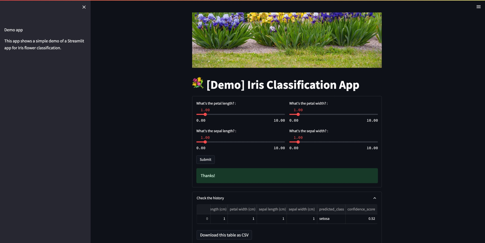

# 🚀 Streamlit Iris App 🚀

There are many ways to make web interfaces to allow interaction with Machine Learning models and we will cover two of them.

[](https://img.shields.io/badge/Python-3776AB?style=for-the-badge&logo=python&logoColor=white)
[](./LICENSE)


[](https://github.com/ellerbrock/open-source-badges/)

## Introduction

Now that you know how to build some Machine Learning models, it is the time to discover how to embeded it into a web app with a user-friendly interface. You have already saw, of course, some ML tools and you maybe played with it. If so, you know that it is much more interesting to interact with a ML model through a beautiful interface than using a notebook, especially when you are not an expert of this domain.  

In this project, we aim to help you to discover how to embed a ML model into a web app to interact with it much easier, by inputing the required information, making predictions and showing the result.


## Description

You will have a minimal interface demo with [Gradio](https://gradio.app/) & [Streamlit](https://streamlit.io/), this will just serve you to make sure that everything works correctly. Then, you will have to make your own interfaces, those allowing you to interact with a Machine Learning model, that is to say:
- Pass values through the interface;
- Recover these values in backend;
- Apply the necessary processing;
- Submit the previously processed values to the ML model to make the predictions;
- Process the predictions obtained and display them on the interface.


## Installation

You have two ways in order to setup and run this project.

### Setup

You need [`Python3`](https://www.python.org/) on your system to setup this app. Then you can clone this repo and being at the repo's `root :: streamlit-iris-app> ...`  follow the steps below:

- Windows:
        
        python -m venv venv; venv\Scripts\activate; python -m pip install -q --upgrade pip; python -m pip install -qr requirements.txt  

- Linux & MacOs:
        
        python3 -m venv venv; source venv/bin/activate; python -m pip install -q --upgrade pip; python -m pip install -qr requirements.txt  


**NB:** For MacOs users, please install `Xcode` if you have an issue.

- Run the demo apps (being at the repository root):

  Streamlit: 

      streamlit run src/app.py

  - Go to your browser at the following address :
        
      http://localhost:8501

## Repository Tree
```.
├── readme.md
├── requirements.txt
├── screenshots
└── src
    ├── app.py
    └── assets
        ├── dataset
        ├── ml
        └── tmp

7 directories, 4 files
```
## Screenshots

<table>
    <tr>
        <th> Streamlit App </th>
    </tr>
    <tr>
        <td></td>
    </tr>
</table>

## Resources
Here are some resources you could explore to get a good understanding of Streamlit :
- [Get started with Streamlit](https://docs.streamlit.io/library/get-started/create-an-app)


## Contributing

Feel free to make a PR or report any issue, Thanks in advance 😃.

Oh, one more thing, please do not forget to put a description when you make your PR 🙂.

## Author

- [Emmanuel KOUPOH](https://www.linkedin.com/in/esa%C3%AFe-alain-emmanuel-dina-koupoh-7b974a17a/)
[](https://twitter.com/emmanuelkoupoh)
